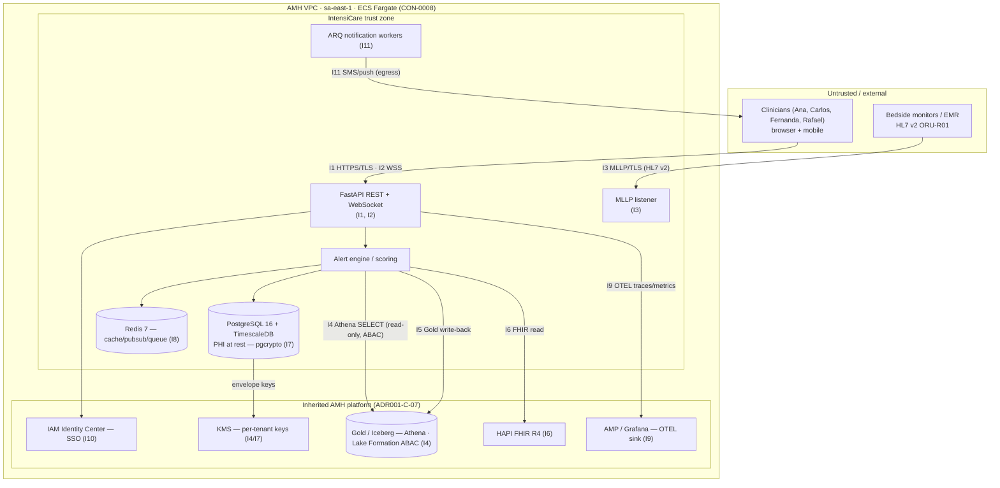
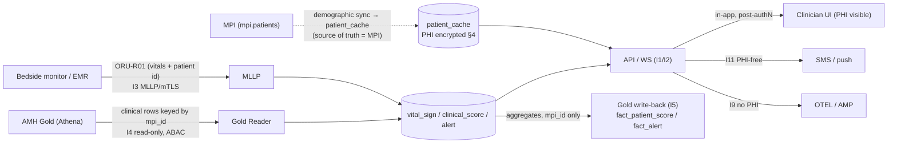

# Security & LGPD Architecture — IntensiCare v2

**Owner:** security-lgpd-engineer · **Status:** draft for reconciliation barrier **B** (security model + invariants #1/#4) · **Authority precedence:** ADR-001 ≻ vision ≻ directive ≻ audit (CONTRACTS §5).

This document specifies IntensiCare's **security and LGPD posture** as a *consumer* of the AMH Data Platform. It does **not** re-invent the platform's controls — it **inherits** them (`ADR001-C-07` / `CON-0007`: IAM Identity Center SSO, per-tenant KMS, Lake Formation ABAC) and adds only the application-tier controls that live inside IntensiCare's own boundary: the operational PostgreSQL/TimescaleDB store, the REST/WebSocket API, the MLLP listener, and the role/permission model. Every constraint relied on is cited as `CON-00NN` (with its brief twin `ADR001-C-NN` / `IMP-C-NN` / `VIS-C-NN`).

> **The load-bearing sentences.** (1) IntensiCare persists no plaintext PHI at rest — `nome`/`CPF`/`CNS`/`MRN`/`birth_date` are `pgcrypto`-encrypted under a **per-tenant, KMS-issued** data key (invariant **#4**, `CON-0069`/`CON-0103`). (2) Every mutating action and every PHI read writes exactly one row to an **append-only, trigger-immutable** `audit_trail` (invariant **#1**, `CON-0066`/`CON-0097`). (3) Authorization is **deny-by-default**: no permission, no access — inverting the legacy `ignorePermission=true` posture (`CON-0038`) and refusing the legacy shared-signing-PIN pattern (RULE-AUTH-USUARIOS-063).

---

## 0. Constraint ledger used by this document

| Constraint | Ledger id | Brief twin | What it forces here | Section |
|---|---|---|---|---|
| Encryption at rest — `pgcrypto` for PHI (nome, CPF, CNS) | `CON-0069`, `CON-0103` | `IMP-C-04` / invariant #4 | §4 pgcrypto/KMS design; §7 REQ-INV-4 | §4, §7 |
| Immutable audit trail — `audit_trail` append-only + anti-mutation trigger | `CON-0066`, `CON-0097` | `IMP-C-01` / invariant #1 | §5.3 access audit; §7 REQ-INV-1 | §5, §7 |
| Inherited security model — IAM IC SSO + KMS/tenant + Lake Formation ABAC | `CON-0007` | `ADR001-C-07` | §2 trust boundaries; §4 KMS; §5 roles | §2, §4, §5 |
| Deny-by-default route enforcement, server-side, ahead of shell render | `CON-0038` | `ADR-C-05` (audit) | §5 role/permission model | §5 |
| Multi-tenancy via `tenant_id` (VARCHAR(32)) in `patient_cache` + `threshold_config` | `CON-0059` (mtenancy) | — | §4.2 key-per-tenant; §2 boundaries | §2, §4 |
| MPI `mpi_id` sole patient identity; mint no identifiers | `CON-0002` | `ADR001-C-02` | §3 PHI map (identity is external) | §3 |
| Operational-only Postgres/TimescaleDB; not analytical | `CON-0003` | `ADR001-C-03` | §3 PHI scope; §6 conformity retention | §3, §6 |
| ECS Fargate, same VPC/accounts, region **sa-east-1** | `CON-0008` | `ADR001-C-08` | §2 network boundary; §6 data residency | §2, §6 |
| OTEL → AMP/Grafana only (telemetry egress) | `CON-0006` | `ADR001-C-06` | §2 boundary #9; §3.4 PHI-in-logs risk | §2, §3 |
| LGPD sensitive-data + RIPD mandatory; legal basis Art. 7º VII (life) | `CON-00xx` (vision) | `VIS-C` / `IMP-C-09` | §3 RIPD inputs; §6 conformity matrix | §3, §6 |
| 7-year retention (LGPD/CFM) | vision §7.2 | `VIS-C` | §6 retention row | §6 |
| SBIS (primary) + ISO 27001 + annual pentest | `IMP-C` | `IMP-5.1-06` | §8 certification checklist | §8 |

> **Two source discrepancies surfaced, not silently resolved.** (a) `patient_cache`'s 11-column DDL (`DM` brief) lists `display_name`, `mrn`, `birth_date`, `gender` but **no `CPF`/`CNS` columns**, while invariant #4 (`CON-0069`) names `CPF`/`CNS` explicitly. This design treats `CPF`/`CNS` as **encrypted-if-present** and makes `display_name`/`mrn`/`birth_date` the concrete PHI encrypted today (§4.1). (b) `CON-0069` owner is `security-architect`; `CON-0066` owner is `data-architect` — the *schema* register for these invariants lives in `architecture/data-model.md §9`; the *control* register lives here (§7). The two are cross-linked, not duplicated.

---

## 1. Scope & method

**In scope (IntensiCare's own boundary):** operational PostgreSQL 16 / TimescaleDB 2.18 store; FastAPI REST + WebSocket API; HL7 v2 MLLP listener; ARQ notification delivery; Redis 7; the application role/permission model; PHI-at-rest encryption; the audit trail.

**Inherited (NOT re-implemented — `ADR001-C-07`):** SSO/IdP (IAM Identity Center); KMS key hierarchy; Lake Formation ABAC over Gold; VPC/network/account isolation (sa-east-1); the MPI as identity authority.

**Method.** §2 draws trust boundaries and runs **STRIDE per interface**. §3 maps the PHI data-flow and derives the RIPD inputs. §4 designs `pgcrypto` + per-tenant KMS (invariant #4). §5 designs the **deny-by-default** role/permission model and names the legacy shared-PIN cautionary tale plus its countermeasure. §6 is the LGPD conformity matrix. §7 registers the security-tier REQ-INV rows for invariants #1 and #4. §8 is the pentest/SBIS/ISO-27001 readiness checklist.

---

## 2. Threat model — trust boundaries & STRIDE per interface

### 2.1 Trust-boundary map



**Boundaries that matter most (PHI-crossing):** I1/I2 (clinician ⇄ API), I3 (monitor → MLLP), I7 (app → PHI store), I11 (alert → clinician mobile), I9 (telemetry egress — must carry **no PHI**).

### 2.2 STRIDE per interface

Legend: **S**poofing · **T**ampering · **R**epudiation · **I**nformation disclosure · **D**enial of service · **E**levation of privilege. "Inherited" = mitigated by the AMH platform control (`ADR001-C-07`); "App" = IntensiCare must build it.

| # | Interface | Top STRIDE threats | Mitigation (owner) |
|---|---|---|---|
| **I1** | Clinician → **REST API** (HTTPS) | **S**: stolen/replayed session token (legacy 30-day cookie — RULE-AUTH-USUARIOS bad pattern). **E**: request a permission not held. **I**: PHI in error bodies / verbose 500s. **R**: deny having acknowledged/edited. | **App**: OIDC bearer from IAM IC (I10), short TTL + refresh, no 30-day cookies; **deny-by-default** authz gate server-side **before** shell render (`CON-0038`, §5); RFC 7807 problem+json with no PHI; every mutation → `audit_trail` (invariant #1, §5.3). TLS 1.2+ enforced at ALB. |
| **I2** | Clinician → **WebSocket** push (WSS) | **S**: unauthenticated socket subscribes to another tenant's bed-board. **I**: cross-tenant fan-out of alerts. **D**: connection-flood exhausts workers. | **App**: authenticate on WS handshake (same OIDC), bind subscription to `tenant_id`+`unit` scope from the token, per-connection rate/back-pressure caps; server-side tenant filter on every push (never trust client-supplied unit). |
| **I3** | Monitor/EMR → **MLLP listener** (HL7 v2 ORU-R01) | **S**: rogue host injects fabricated vitals → false scores/alerts. **T**: altered ORU segments. **D**: malformed-message flood. **R**: no attribution of source. | **App**: mutual-TLS on the MLLP socket + source allow-list (VPC-internal only, no public ingress); strict HL7 parse + reject on schema violation; **idempotency on MSH-10** (`CON-0067`, invariant #2) blocks replay/dup; `source_system` stamped for attribution; ACK/NAK semantics; rate cap per source. |
| **I4** | Gold Reader → **Athena/Gold** (read) | **E**: scan partitions of a tenant IC may not read. **I**: over-broad SELECT. | **Inherited**: Lake Formation **ABAC** + per-tenant KMS decide readable partitions (`ADR001-C-07`); IC adds **no parallel authz** — least-privilege IAM task role scoped to the IC Glue DB/columns only. High-watermark, column-projected polls (no `SELECT *`). |
| **I5** | Gold Writer → **Gold** (`fact_patient_score`/`fact_alert`) write-back | **T**: corrupt corporate analytics. **E**: write outside IC's fact tables. | **Inherited + App**: IAM task role write-scoped to exactly the two fact tables; schema-versioned writes (`ADR001-C-09`); write-back carries **no direct identifiers** beyond `mpi_id` (§3.3). |
| **I6** | FHIR enrichment client → **HAPI FHIR** (read) | **I**: pull more PHI than the score needs. **S**: client impersonation. | **Inherited**: existing HAPI FHIR authz (`ADR001-C-05`). **App**: least-scope reads (only resources needed for context), service credential from secrets manager, no local FHIR store. |
| **I7** | App → **PostgreSQL/TimescaleDB** (PHI at rest) | **I**: DB dump / stolen snapshot / backup leak exposes PHI. **T**: unauthorized row edits. **E**: one tenant decrypts another's PHI. | **App**: `pgcrypto` column encryption, **per-tenant KMS DEK** injected per session, never stored in DB (§4); blind-index HMAC for equality lookups; TLS to DB; backups inherit KMS envelope encryption; cross-tenant decrypt fails (§7 REQ-INV-4). |
| **I8** | App ⇄ **Redis 7** (cache/pubsub/queue) | **I**: PHI cached in plaintext, survives in memory/RDB dumps. **S**: unauthenticated Redis. | **App**: Redis AUTH + TLS + VPC-private; **cache only non-PHI or short-TTL de-identified** score payloads keyed by `mpi_id`; no `nome`/`CPF`/`CNS` in cache values; disable persistence for PHI-bearing keys. |
| **I9** | App → **OTEL / AMP-Grafana** (telemetry egress) | **I**: PHI leaks into logs/traces/span attributes/metric labels. | **App**: structured logging with a **PHI-redaction filter**; never log `nome`/`CPF`/`CNS`/`MRN` or raw HL7 bodies; span attributes carry `mpi_id`+`request_id` only; log review in the pentest checklist (§8). |
| **I10** | App → **IAM Identity Center** (SSO/OIDC) | **S**: forged token. **E**: over-broad claims. | **Inherited**: IdP-issued OIDC (`ADR001-C-07`). **App**: verify signature/issuer/audience/exp, map IdP groups → IC roles (§5), **fail closed** on any validation error. |
| **I11** | ARQ → **clinician mobile** (SMS/push egress) | **I**: PHI in an SMS body to a wrong/roamed number. **D**: notification storm. | **App**: alert payloads carry **no PHI** — bed/unit + severity + deep-link only, PHI shown only after in-app authN; retry+backoff+DLQ (invariant #6, `CON-0071`); rate/dedup caps. |

**Cross-cutting (all interfaces).** *Repudiation* is closed system-wide by invariant #1 (append-only `audit_trail`, §5.3). *Elevation* is closed by the deny-by-default model (§5). *Spoofing* funnels through IAM IC (I10). *Residency*: all interfaces are in-VPC / sa-east-1 (`CON-0008`) — no PHI crosses a region boundary.

---

## 3. PHI data-flow map & RIPD inputs

### 3.1 PHI / sensitive-data inventory (IntensiCare's own store)

Under LGPD **health data is sensitive personal data** (Art. 5º II); processing purpose is **clinical decision support** (Art. 6º I); legal basis is **protection of the life / physical safety of the data subject** (Art. 7º VII), plus execution of public-health policy (Art. 7º III) where the hospital is public. A **RIPD (Relatório de Impacto à Proteção de Dados)** is **mandatory** (`IMP-C-09`).

| Data element | Table.column | Category | At-rest treatment |
|---|---|---|---|
| Patient name (`nome`) | `patient_cache.display_name` | Direct identifier | **pgcrypto-encrypted** (§4) |
| CPF | (invariant #4 — *encrypt-if-present*, not in current 11-col DDL) | Direct identifier (national ID) | **pgcrypto-encrypted** |
| CNS (cartão nacional de saúde) | (invariant #4 — *encrypt-if-present*) | Direct identifier (health-card) | **pgcrypto-encrypted** |
| MRN | `patient_cache.mrn` | Direct identifier | **pgcrypto-encrypted** + HMAC **blind index** for lookup |
| Birth date | `patient_cache.birth_date` | Quasi-identifier | **pgcrypto-encrypted** |
| Gender, bed, unit, admission | `patient_cache.gender/bed_id/unit/admission_dt` | Quasi-identifier / context | Access-controlled; not free-text PHI |
| **MPI id** | `patient_cache.mpi_id` (+ FK on all tables) | Pseudonymous key (external) | Not minted by IC (`CON-0002`); pseudonym, not plaintext identity |
| Vital signs | `vital_sign.*` (HR, BP, SpO2, RR, temp, AVPU) | **Sensitive health data** | Access-controlled; linked only by `mpi_id` |
| Scores / components | `clinical_score.*` | Derived health data | Access-controlled |
| Alert text | `alert.body/title` | Derived health data (may embed clinical text) | Access-controlled; keep PHI-free in notifications (I11) |
| Acknowledging clinician | `alert.acknowledged_by` | Staff personal data | Access-controlled; audited |
| Audit snapshots | `audit_trail.before/after_state` | May embed PHI | **Encrypted** (data-model REQ-INV-4-3) |

**Design consequence of `CON-0002`.** IntensiCare mints **no patient identity of its own** — the MPI `mpi_id` is a pseudonym issued by the external Master Patient Index. Re-identification requires the encrypted `patient_cache` columns **and** the tenant DEK. This makes `mpi_id`-keyed vitals/scores/alerts **pseudonymized** (LGPD Art. 12) once the demographic columns are encrypted — a material risk-reducer in the RIPD.

### 3.2 PHI ingress/egress flows



### 3.3 Egress minimization
- **Gold write-back (I5)** carries `mpi_id` + aggregates only — **no `nome`/`CPF`/`CNS`** re-exported to the analytical layer.
- **Notifications (I11)** carry bed/unit/severity/deep-link — **no PHI** off-platform.
- **Telemetry (I9)** carries `mpi_id`/`request_id` — **no PHI** in logs/traces.

### 3.4 RIPD inputs (hand-off to the DPO)
1. **Purpose** — clinical decision support for ICU deterioration (Art. 6º I); no secondary use without new basis.
2. **Legal basis** — Art. 7º VII (protection of life) + Art. 7º III (public-health policy) where applicable; **not** consent-based (emergency/vital context).
3. **Data categories & subjects** — sensitive health data + direct identifiers of ICU patients; staff personal data (acknowledgers).
4. **Flows & recipients** — §3.2 map; recipients are treating clinicians only; AMH Gold (internal analytics, pseudonymized).
5. **Retention** — 7 years (LGPD/CFM), §6.
6. **Risks & safeguards** — STRIDE table (§2.2) as the risk register; pgcrypto+KMS (§4), deny-by-default (§5), immutable audit (§5.3), pseudonymization via MPI (§3.1) as the mitigations.
7. **Data residency** — sa-east-1 only (`CON-0008`); no international transfer.
8. **Subject rights** — access/correction routed via the MPI (source of truth) + IC's audit trail for the "who accessed my data" report (§5.3).

---

## 4. Encryption design — pgcrypto + per-tenant KMS (invariant #4)

**Requirement (`CON-0069`/`CON-0103`/`IMP-C-04`):** PHI encrypted at rest with `pgcrypto`, **before the first real patient**. Absence = LGPD Art. 46 violation. **KMS is per-tenant** (`ADR001-C-07`).

### 4.1 What is encrypted
`patient_cache.display_name`, `mrn`, `birth_date`, and `CPF`/`CNS` **if present** → stored as `BYTEA` ciphertext (`pgcrypto` `pgp_sym_encrypt`). Plaintext is **never** persisted in any column, index, or WAL-visible form. Equality lookups on `mrn` use a **keyed HMAC blind index** (`mrn_bidx`), so no plaintext/ciphertext scan is needed and no plaintext index exists.

### 4.2 Key hierarchy (per-tenant, KMS-issued — ADR-001 invariant respected)

```
AWS KMS (per-tenant CMK, sa-east-1)              ← inherited AMH control (ADR001-C-07)
        │  GenerateDataKey (per tenant)
        ▼
Tenant Data-Encryption Key (DEK, plaintext in memory only)
        │  injected per DB session as a GUC / session var — NEVER stored in the DB or source
        ▼
pgcrypto column encrypt/decrypt  (patient_cache PHI, audit_trail snapshots)
```

- **One CMK per `tenant_id`** — a tenant can only ever decrypt its own rows; a cross-tenant decrypt (wrong DEK) **fails** (REQ-INV-4-S2). This directly satisfies the per-tenant-KMS clause of `CON-0007` and the multi-tenancy invariant (`tenant_id` in `patient_cache`).
- **DEK lifecycle** — fetched via KMS `GenerateDataKey`/`Decrypt` at session bootstrap, held **in process memory only**, set as a session GUC for the transaction, dropped on session end. Never written to a column, config file, env var, or source.
- **No embedded keys** — schema/seed/source contain **no** key material (verified by grep in CI, REQ-INV-4-S2).
- **Rotation** — CMK rotation is a KMS/platform operation; DEK re-wrap is a background re-encrypt job; audited (§5.3).

### 4.3 In-transit
TLS 1.2+ on **every** hop: ALB→API (I1/I2), MLLP mTLS (I3), app→PG, app→Redis (I8), app→Athena/FHIR/KMS. No plaintext PHI on any wire.

### 4.4 Backups
Backups inherit the KMS envelope (encrypted columns stay ciphertext in dumps); a stolen backup without the tenant DEK yields no plaintext PHI — this is the concrete answer to the I7 "stolen snapshot" threat.

---

## 5. Role / permission model — DENY-BY-DEFAULT

**Governing invariant (`CON-0038`):** route-level enforcement **defaults to on**; the auth/tenant gate runs **server-side, ahead of shell render** — never a client JSX conditional. This **inverts** the legacy `ignorePermission=true` default. The design below mines the legacy findings in `_work/dispositions/auth-usuarios-p1.yaml`/`-p2.yaml` (63 rules) and adopts the good patterns while explicitly rejecting the dangerous ones.

### 5.1 The cautionary tale — RULE-AUTH-USUARIOS-063 (shared signing PIN)

> **Finding (RULE-AUTH-USUARIOS-063, disposition RATIFY, band ADDENDUM ESC-ADDENDUM-350):** *"any user whose PIN was never rotated legally signs medical documents/prescriptions with an org-wide shared default secret."*

In the legacy system, e-signature PINs shipped with a **single org-wide default**. Any user who never rotated it signed clinical documents/prescriptions with a **non-unique secret** — which **destroys per-user attribution** of clinical e-signatures. This is precisely the class of defect that invariant #1 (audit) is meant to make impossible, and it cannot be fixed by naming; it needs a structural countermeasure.

**Countermeasure (design mandate for IntensiCare v2):**
1. **Per-user credentials only — no shared defaults.** No account ships with a usable default signing secret; a shared/default secret can never authorize a signing action.
2. **Signing requires an individual key.** Any clinical sign-off (alert acknowledgement with clinical weight, future prescription/document signing) requires a per-user credential bound to that user's identity (IAM IC-backed), not a PIN pool.
3. **Signing is audited individually.** Every signing/ack action writes an `audit_trail` row with the **individual** actor (`alert.acknowledged_by` + audit actor), before/after, and `request_id` — attribution is non-repudiable (invariant #1).
4. **Rotation-independent security.** Security must not depend on a user having rotated a default — there is no insecure default state to leave.

### 5.2 Patterns mined from the legacy dispositions

| Legacy pattern (source_quote) | Rule | Disposition | v2 stance |
|---|---|---|---|
| *"defaulting every entry to False, then flips to True"* | RULE-…-001 | RATIFY | **ADOPT** — this **is** deny-by-default; make it the catalog build rule. |
| *"any permission not present in the system catalog is silently excluded from the effective map"* | RULE-…(p2) | NOT_APPLICABLE | **ADOPT the deny, reject the silence** — unknown permission ⇒ denied **and logged**, never silently dropped. |
| *"closed catalog of 28 permission flags"* | RULE-…(p2) | NOT_APPLICABLE | **ADOPT** a **closed, enumerated** permission catalog — no implicit/wildcard grants. |
| *"named bundle of the entire Permissions boolean map plus a list of member users"* | RULE-…(p2) | NOT_APPLICABLE | **ADAPT** into roles = named permission sets; assign users to roles, not raw boolean maps. |
| *"effective permission codenames … union of permissions granted by access-groups"* | RULE-…-p1 | NOT_APPLICABLE | **ADOPT** additive union of role grants — but union of **grants only**, deny is the absence of a grant. |
| *"Grants access to any user that exists and is not anonymous"* | RULE-…-p1 | NOT_APPLICABLE | **REJECT** — "authenticated" ≠ "authorized"; every route needs an explicit permission. |
| *"object-level access … requesting user's id equals the object's owner id"* | RULE-…-p1 | NOT_APPLICABLE | **ADOPT** object-level checks **plus** tenant scoping (owner **and** same `tenant_id`). |
| *"auth token cookie 30-day lifetime"* | RULE-…(p2) | NOT_APPLICABLE | **REJECT** — short-TTL OIDC bearer + refresh; no 30-day session cookie. |
| *"'JWT' followed by a space and the raw token"* | RULE-…(p2) | NOT_APPLICABLE | **REPLACE** with standard `Authorization: Bearer` OIDC from IAM IC (I10). |
| *"shared default signing PIN"* | **RULE-…-063** | **RATIFY** | **REJECT** — §5.1 countermeasure. |

### 5.3 v2 model

- **Subjects** — clinician identities from IAM Identity Center (I10); IdP groups map to IC roles.
- **Roles (named permission sets)** — aligned to personas: `nurse` (Ana — view scores/vitals, ack alerts, document actions), `intensivist` (Carlos — all nurse + score detail + config-read), `coordinator` (Fernanda — bed-board + metrics dashboard), `rrt` (Rafael — critical-alert receive/ack), `admin` (threshold config, user-role admin). Each role is a **closed enumerated** set from the permission catalog.
- **Enforcement** — deny-by-default at the route (`CON-0038`), evaluated **server-side before render**; unknown/absent permission ⇒ **403 + audit log**, never a silent pass. Tenant scope (`tenant_id`) and unit scope are enforced on every read/subscription (I1/I2), never trusted from the client.
- **Audit (invariant #1 — the access-audit backbone).** Every login, every PHI read, every alert ack/resolve, every threshold edit, every role change, and every signing action writes **exactly one** `audit_trail` row (append-only, `BEFORE UPDATE OR DELETE` trigger blocks mutation — `CON-0066`/`CON-0097`) with actor, action, entity, before/after, and OTEL `request_id`. This is what makes the LGPD "who accessed my data" subject-right answerable (§3.4) and closes *Repudiation* across all interfaces.

---

## 6. LGPD conformity matrix

| LGPD requirement | Article | IntensiCare control | Evidence / status |
|---|---|---|---|
| Sensitive-data safeguard | Art. 5º II, 6º | Health data treated as sensitive; purpose-bound to CDS | §3.1; RIPD §3.4 |
| Legal basis | Art. 7º VII / III | Protection of life (+ public-health policy) | RIPD §3.4 |
| Security / prevention (encryption) | **Art. 46 / 47** | `pgcrypto` at rest + per-tenant KMS (§4); TLS everywhere (§4.3) | invariant #4, REQ-INV-4-S* (§7) |
| Encryption in transit | Art. 46 | TLS 1.2+ on all hops; MLLP mTLS | §4.3 |
| Pseudonymization | Art. 12 | MPI `mpi_id` as pseudonym; demographics encrypted | §3.1 (`CON-0002`) |
| Access control (least privilege) | Art. 46 | Deny-by-default roles (§5); Lake Formation ABAC (Gold) | `CON-0038`, `CON-0007` |
| Access audit / traceability | Art. 37 (registro) | Append-only immutable `audit_trail` | invariant #1, REQ-INV-1-S* (§7) |
| Retention limit | Art. 15–16 | **7-year** retention (LGPD/CFM), then disposal | vision §7.2 — *retention-vs-model discrepancy flagged in ledger; disposal job TBD* |
| Data-subject rights | Art. 18 | Access/correction via MPI; access report via audit trail | §3.4 |
| RIPD / DPIA | Art. 38 | RIPD inputs prepared for DPO | §3.4 (`IMP-C-09`) |
| Data residency | (transfer, Art. 33) | sa-east-1 only; no international transfer | `CON-0008` |
| Incident duty | Art. 48 | Breach-notify runbook (to author) | §8 checklist |
| README correction | — | Remove "HIPAA"/"GDPR" → "LGPD"/"SBIS" | `IMP-C-07` (blocker) |

---

## 7. Invariant verification register — REQ-INV-1 / REQ-INV-4 (security tier)

Security-control-tier requirements owned by **this** document. IDs use the `-S` suffix to sit alongside the **schema-tier** twins in `architecture/data-model.md §9` (REQ-INV-1-1..3, REQ-INV-4-1..3) — cross-linked, not duplicated.

| Req id | Requirement | Verification | Component (owner) |
|---|---|---|---|
| **REQ-INV-1-S1** | Every state-changing action **and every PHI read** — login, alert ack/resolve, threshold edit, role change, signing — writes exactly one `audit_trail` row with actor, action, before/after, `request_id`, before the first real patient (`CON-0066`/`CON-0097`/`IMP-C-01`). | Integration test per mutating/reading endpoint asserts one audit row with correct actor/action/entity + `request_id` tying to the OTEL trace; a PHI-read endpoint produces a read-audit row. | API service layer + audit writer (twins: REQ-INV-1-1/-2 in data-model). |
| **REQ-INV-1-S2** | The `audit_trail` is **append-only**: a `BEFORE UPDATE OR DELETE` trigger blocks every mutation; no code path can edit/erase a row. | Seed a row, attempt `UPDATE`/`DELETE` → exception, row unchanged; grep app for any audit `UPDATE`/`DELETE` → none. | Operational DB / migrations (`trg_audit_trail_immutable`) (twin: REQ-INV-1-1). |
| **REQ-INV-1-S3** | Signing/ack attribution is **individual and non-repudiable** — no shared/default secret can authorize a signing action (countermeasure to RULE-AUTH-USUARIOS-063). | Attempt to sign with a default/shared credential → rejected; every ack/sign audit row carries a unique per-user actor; no org-wide default signing secret exists in config/seed. | Auth + signing path (§5.1). |
| **REQ-INV-4-S1** | PHI (`display_name`, `mrn`, `birth_date`, `CPF`/`CNS` if present) is stored **pgcrypto-encrypted** (BYTEA); plaintext never persisted in column, index, or dump (`CON-0069`/`CON-0103`/`IMP-C-04`). | Inspect raw table bytes/`pg_dump` → ciphertext only, no plaintext PHI; decrypt round-trip unit test; confirm `mrn` equality uses `mrn_bidx`, no plaintext MRN index. | `patient_cache` + pgcrypto (twin: REQ-INV-4-1/-3). |
| **REQ-INV-4-S2** | Encryption keys are **per-tenant, KMS-issued** DEKs injected per session, **never stored** in DB or source; a cross-tenant decrypt with the wrong key **fails** (`CON-0007`/`ADR001-C-07`). | Grep schema/seed/source for embedded key material → none; verify DEK set per session + rotated; attempt decrypt of tenant A's row with tenant B's DEK → fails. | Key-management (KMS) + session bootstrap (twin: REQ-INV-4-2). |
| **REQ-INV-4-S3** | PHI does **not** leak across the minimizing egress boundaries: Gold write-back (I5), notifications (I11), and telemetry (I9) carry no `nome`/`CPF`/`CNS`/`MRN`. | Contract test on write-back payload → only `mpi_id`+aggregates; notification payload → no PHI; log/trace scrub test asserts redaction filter drops PHI fields. | Gold writer, ARQ workers, OTEL exporter (§3.3). |

---

## 8. Pentest / SBIS / ISO 27001 readiness checklist

Certifications targeted (`IMP-5.1-06`): **SBIS (primary)**, **ISO 27001 (recommended)**, **annual pentest**. HIPAA/GDPR do **not** apply and must be struck from the README (`IMP-C-07`).

**Annual pentest — pre-engagement.**
- [ ] Scope = I1/I2/I3/I11 external interfaces + authz (deny-by-default) + tenant isolation + PHI-at-rest.
- [ ] Test **cross-tenant** access (I4/I7) and cross-tenant decrypt (REQ-INV-4-S2) explicitly.
- [ ] Test the **shared-PIN class** is gone (REQ-INV-1-S3) — attempt signing with default creds.
- [ ] **PHI-in-logs** grep across AMP/Grafana (I9) — must be clean.
- [ ] Session/token: no 30-day cookie, short-TTL bearer, refresh rotation.
- [ ] MLLP mTLS + source allow-list + malformed-flood DoS test (I3).
- [ ] Remediation SLA + retest before sign-off.

**SBIS (primary).**
- [ ] Digital-signature/attribution controls (per-user, §5.1) documented.
- [ ] Access-control policy + audit-trail evidence (invariant #1) mapped to SBIS control set.
- [ ] Encryption-at-rest/in-transit evidence (§4) attached.
- [ ] CFM 1.821/07 record-keeping alignment (audit immutability).

**ISO 27001 (recommended).**
- [ ] ISMS scope statement = IntensiCare trust zone (§2.1).
- [ ] Risk register = STRIDE table (§2.2) + RIPD risks (§3.4).
- [ ] Statement of Applicability mapping Annex A → §4/§5/§6 controls.
- [ ] Key-management procedure (§4.2) + rotation runbook.
- [ ] Incident-response runbook (LGPD Art. 48 breach-notify) — **to author**.
- [ ] Supplier/inherited-control attestation from AMH platform (`CON-0007`).

**Standing blockers to clear before first real patient (barrier B):** invariant #1 audit trail; invariant #4 pgcrypto+KMS; RIPD elaborated (`IMP-C-09`); README HIPAA/GDPR→LGPD/SBIS fix (`IMP-C-07`); deny-by-default enforcement live (`CON-0038`).

---

## 9. Open questions (to reconciliation barrier B)
1. **CPF/CNS columns.** Invariant #4 names `CPF`/`CNS`, but the current `patient_cache` DDL (11 columns) omits them. Decide: add encrypted columns, or confirm they never land in IC and scope invariant #4 to `display_name`/`mrn`/`birth_date`. (Owner: data-architect + security.)
2. **DEK injection mechanism.** Session GUC vs. per-transaction parameter for the pgcrypto key — pin the exact `pgcrypto` call + key-passing path with data-architect.
3. **Retention disposal.** 7-year retention is stated; the **disposal/erasure job** (LGPD Art. 16) is undefined — who runs it and how it interacts with the append-only `audit_trail`.
4. **Signing scope.** Whether alert-ack alone constitutes a clinical e-signature, or signing applies only to future prescription/document features — sets how far REQ-INV-1-S3 reaches.
