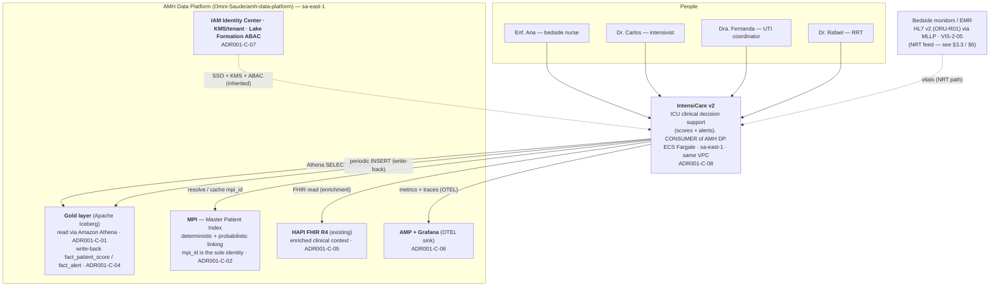
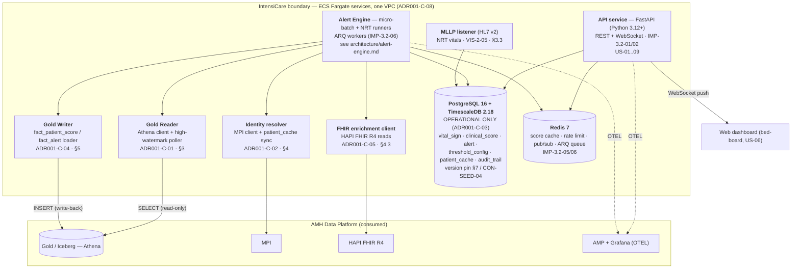
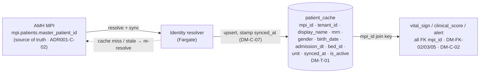
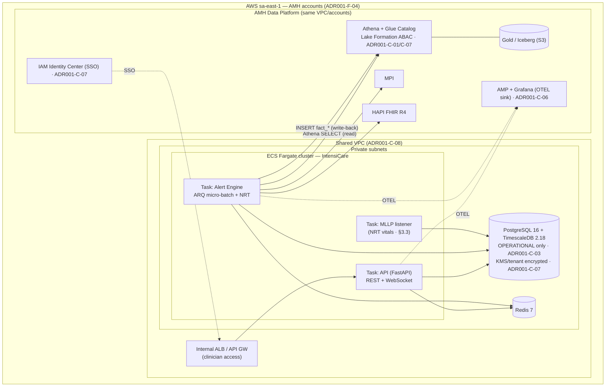

# System Architecture — IntensiCare v2 as an AMH Data-Platform Consumer

**Owner:** amh-integration-architect · **Status:** draft for reconciliation barrier **B** (platform-integration + version pins) · **Authority precedence:** ADR-001 ≻ vision ≻ directive ≻ audit (CONTRACTS §5).

This document specifies the **C4 Levels 1–3** of IntensiCare v2 under the single governing decision of **ADR-001: IntensiCare is a specialized *consumer* of the AMH Data Platform, not a parallel data platform.** Every ADR-001 constraint relied on is cited as `ADR001-C-NN` (with its ledger twin `CON-00NN`); brief facts are cited as `ADR001-F-NN` / `VIS-*` / `IMP-*` / `DM-*`. Nothing here contradicts ADR-001; where a downstream promise (e.g. `VIS-C-09`) collides with it, the collision is surfaced as a decision table (§6), not silently resolved.

> **The load-bearing sentence.** IntensiCare implements **no ingestion of its own** and reads clinical data **only from the AMH Gold layer via Amazon Athena** (`ADR001-C-01` / `CON-0001`). It mints **no patient identifiers** — the MPI `mpi_id` is the sole key (`ADR001-C-02` / `CON-0002`). Its PostgreSQL/TimescaleDB is **operational-only** (`ADR001-C-03` / `CON-0003`). Historical scores/alerts are **written back to Gold** as `fact_patient_score` / `fact_alert` (`ADR001-C-04` / `CON-0004`). It uses the **existing HAPI FHIR** server (`ADR001-C-05` / `CON-0005`), the **existing OTEL → AMP/Grafana** stack (`ADR001-C-06` / `CON-0006`), the **inherited security model** (`ADR001-C-07` / `CON-0007`), deploys on **ECS Fargate in the same VPC / accounts / region sa-east-1** (`ADR001-C-08` / `CON-0008`), treats **Gold-schema changes as versioned breaking changes** (`ADR001-C-09` / `CON-0009`), and **inherits the 99.5% data-availability SLO** (`ADR001-C-10` / `CON-0010`).

---

## 0. Constraint ledger used by this document

| ADR-001 constraint | Ledger id | What it forces on this architecture | Section |
|---|---|---|---|
| `ADR001-C-01` no own ingestion; Athena-only reads from Gold | `CON-0001` | §3 consumption pattern; §6 escape hatch | §3, §6 |
| `ADR001-C-02` MPI `mpi_id` sole identity | `CON-0002` | §4 identity flow | §4 |
| `ADR001-C-03` operational-only Postgres/TimescaleDB | `CON-0003` | §2 containers; §7 version pin | §2, §7 |
| `ADR001-C-04` Gold write-back `fact_patient_score`/`fact_alert` | `CON-0004` | §5 write-back schemas | §5 |
| `ADR001-C-05` existing HAPI FHIR only | `CON-0005` | §4.3 enrichment | §4 |
| `ADR001-C-06` OTEL → AMP/Grafana only | `CON-0006` | §2, §8 topology | §2, §8 |
| `ADR001-C-07` inherited IAM IC + KMS/tenant + Lake Formation ABAC | `CON-0007` | §8 topology, §3 access | §3, §8 |
| `ADR001-C-08` ECS Fargate, same VPC/accounts, sa-east-1 | `CON-0008` | §8 deployment topology | §8 |
| `ADR001-C-09` Gold-schema change = versioned breaking change | `CON-0009` | §7 contract policy | §7 |
| `ADR001-C-10` inherit 99.5% availability SLO | `CON-0010` | §5.SLO, §6 | §5, §6 |
| `ADR001-F-02` Gold batch p95 < 30 min (Silver-Entities) | — | freshness baseline; §6 trigger metric | §5, §6 |
| `ADR001-F-08` Alternativa B = one dedicated MSK topic | — | §6 escape-hatch mechanism | §6 |

---

## 1. C4 Level 1 — System Context

IntensiCare sits **inside** the AMH landscape, not beside it. Its only **analytical** clinical-data path is the AMH Data Platform (Gold via Athena); its only identity source is the MPI; its only enrichment path is HAPI FHIR; its only analytical sink is the Gold layer. The bedside monitor / HL7 v2 MLLP feed (`VIS-2-05`) is the **one sanctioned sub-batch operational-ingress path** (§3.3) — *operational telemetry, not an analytical read*: it exists to satisfy `VIS-C-09`, its scope relative to `ADR001-C-01` is clarified in `_work/adrs/operational-vitals-ingress.md` (RAT-INGRESS-01, pending platform-team ratification), and it is the boundary ADR-001 flags for the Alternativa-B decision (§6).

**Actors** (`IMP-2.2-01..09`): bedside nurse (Ana), intensivist (Carlos), UTI coordinator (Fernanda), Rapid-Response Team (Rafael). **External systems it depends on and does NOT own:** AMH Gold, MPI, HAPI FHIR, AMP/Grafana, IAM Identity Center / Lake Formation. **The absence of any owned ingestion stack (NiFi/Kafka/Debezium) is itself an architectural statement** (`ADR001-C-01`, `ADR001-F-10`).

---

## 2. C4 Level 2 — Containers

Only the containers inside the IntensiCare boundary are ours. Everything in the `amh` cluster is consumed, not built.

**Container inventory.** API (FastAPI, REST+WS, `IMP-3.2-02`); Alert Engine (ARQ micro-batch + NRT, `IMP-3.2-06`, detailed in `architecture/alert-engine.md`); Gold Reader (Athena, §3); Gold Writer (write-back, §5); Identity resolver (MPI + `patient_cache`, §4); FHIR enrichment client (§4.3); PostgreSQL 16 + TimescaleDB 2.18 **operational store** (`ADR001-C-03`; version pin §7); Redis 7 (`IMP-3.2-05`); MLLP listener (NRT vitals, §3.3). **Observability is not a container we own** — every service exports OTEL to the existing AMP/Grafana (`ADR001-C-06`).

---

## 3. C4 Level 3 — Athena / Gold consumption (polling cadence vs freshness)

### 3.1 The consumption pattern

`ADR001-C-01` (`CON-0001`) is absolute: **clinical reads come only from AMH Gold, only via Athena.** The Gold Reader is therefore a **poller**, never a stream subscriber, and never a CDC consumer (NiFi/Kafka/Debezium are explicitly out of our scope, `ADR001-F-10`).

- **Incremental, high-watermark polls.** Each poll is bounded by a per-domain high-watermark on the Gold snapshot id **and** `ingested_at`, so a poll only reads rows newer than the last successful cursor. This keeps Athena scan cost proportional to new data, not table size, and makes polls idempotent (`INSERT … ON CONFLICT DO NOTHING`, keyed as in `IMP-C-02`).
- **Clinical time vs ingest time stay distinct.** Rows land in `vital_sign` with `recorded_at` (clinical collection) separate from `ingested_at` (Gold arrival), per `DM-C-08` / `CON-0026`. **Freshness and staleness are always measured on `recorded_at`/`collected_at`, never on `ingested_at`** — otherwise a slow batch would masquerade as fresh data.
- **Normalize at the edge.** Units are canonicalized on read (the units-registry gate, `CON-SEED-12`) so the scoring boundary only ever sees canonical units.
- **Access is ABAC-scoped.** Athena/Glue/Lake Formation access is granted through the inherited security model (`ADR001-C-07` / `CON-0007`) — per-tenant KMS and Lake Formation ABAC decide which Gold partitions IntensiCare may scan; IntensiCare adds no parallel authorization.

### 3.2 Polling cadence vs freshness — the core tension

Two numbers govern everything:

| Metric | Value | Source |
|---|---|---|
| AMH Gold batch freshness (Silver-Entities) | **p95 < 30 min** | `ADR001-F-02` |
| Inherited data-availability SLO | **99.5%** | `ADR001-C-10` / `CON-0010` |
| IntensiCare ingest→alert promise | **p95 < 30s** | `VIS-C-09` |

**Cadence never beats source freshness.** Polling Gold every 60 s does not make 30-min-old batch data any fresher — it only shortens the *poll* stage of the pipeline. So per-domain cadence is chosen to (a) minimize the poll stage for high-acuity domains and (b) avoid needless Athena scans for slow-cadence domains. Full per-source numbers live in `_work/platform/amh-freshness.yaml`; the mode selection (micro-batch / NRT / hybrid) is owned by `architecture/alert-engine.md §1.1`.

| Domain | Gold poll cadence | Governing clinical cadence / target | Why |
|---|---|---|---|
| Electrolytes (CRIT K⁺/Na⁺/Ca²⁺) | ~1–2 min (expedited) | fatal in minutes–hours (`VIS-3.6-01`) | Lab-only ⇒ Gold-bound; tighten poll to shrink poll stage. Strongest escape-hatch candidate (§6). |
| Sepsis labs (lactate/PCT/WBC/culture) | ~5 min | detection < 1h (`VIS-3.1-01`) | Batch ≤30 min ≪ 1h target. |
| Respiratory ABG | ~5 min | deterioration >20% in 6h (`VIS-3.3-05`) | Batch acceptable; SpO₂/FiO₂ handled NRT (§3.3). |
| AKI (creatinine/urine) | ~15–30 min | recognition by 6h (`VIS-6.1-02`) | 30-min freshness ≪ 6h. |
| Medication events | ~15 min | on order/admin (`VIS-4.2-07`) | Event-triggered; batch fine. |
| Delirium (RASS/CAM-ICU) | ~1–4h | per shift, 4–12h (`VIS-4.2-05`) | Slow documentation cadence. |
| **Early-warning scores (vitals)** | **N/A via Gold** | **score <30s, alert <5s (`IMP-2.2-02/03`, `VIS-C-09`)** | **Gold batch cannot meet <30s — routes to §3.3 / §6.** |

### 3.3 Vitals operational ingress — the one sanctioned sub-batch path (ADR-clarified)

Bedside early-warning scores (MEWS/NEWS2/qSOFA) and the continuous-monitor components of the hemodynamic/respiratory domains need a **sub-batch feed** — the "local TimescaleDB source … streaming via HL7 ORU / invasive monitor" in `VIS-4.2-01/03/04`. A 30-min Gold batch cannot deliver `VIS-C-09` (<30s); ADR-001 named this exact seam ("insuficiente para o caso de uso de UTI", ADR-001 open-question 1).

**Resolution — one story, replacing the earlier "unresolved / routed" framing.** Bedside-monitor vitals reach the **operational** store via the **existing Phase-1 HL7 v2 MLLP listener** (ORU-R01, `VIS-2-05`) — *operational ingress*, idempotent on `MSH-10` per INV-2 (`alert-engine.md §4.1`). This does **not** breach `ADR001-C-01`. That constraint's "no own ingestion / Athena-only" is scoped to **analytical and clinical-context data** — labs, medications, demographics/identity, cultures, documents — which reach IntensiCare **only** from Gold via Athena (§3.1) or the existing HAPI FHIR server (§4.3). Vitals are **operational telemetry**, not an analytical read; and **the same vitals are ALSO delivered to Gold and replayed from Gold for retrospective/analytical scoring and the `fact_*` write-back (§5)** — so **Gold remains the sole analytical source**. The operational MLLP feed is a live-scoring accelerator, not a second system of record; the operational store never becomes analytical (`ADR001-C-03`). No new ingestion stack is introduced — NiFi/Kafka/Debezium remain excluded (`ADR001-F-10`).

This scope clarification of `ADR001-C-01` is formalized in **`_work/adrs/operational-vitals-ingress.md`** (**RAT-INGRESS-01**) — a **proposed clarification of ADR-001, pending platform-team ratification** (CTO Office + AMH Engineering, `ADR001-F-09`). It is the **working design of record**; if the platform team rejects the scope reading, the fallback is either the pure-batch reading (with a hazard-log entry for the ~30-min early-warning latency it reintroduces) or an accelerated Alternativa-B decision (§6).

**Why not Alternativa B now.** Alternativa B — one dedicated **MSK streaming topic** feeding IntensiCare directly (`ADR001-F-08`) — remains ADR-001's **Fase-4** escape hatch, activated only if the operational MLLP path itself cannot close `VIS-C-09` (the quantified §6 **T1** trigger). The MLLP listener already exists; a new broker is unjustified for MVP. **§6 supplies the quantified trigger ADR-001 left qualitative.**

### 3.4 Athena poll-concurrency budget (240-bed / 4-hospital tier)

The per-domain Gold poll cadences in §3.2 (electrolytes ~1–2 min expedited, sepsis/ABG ~5 min, AKI ~15–30 min, meds ~15 min, delirium ~1–4h) are only deliverable if IntensiCare's **peak concurrent Athena query count** stays inside the AMH DP's regional Athena concurrency quota. That headroom was previously deferred to AMH-DP without a number; this section quantifies it so the cadence commitments are honest.

**Concurrency scales with domains × workgroups, not beds.** A domain poll scans a whole unit/tenant partition, so it is one query per (domain, tenant) per cadence tick — **not** one query per bed. Peak concurrency is therefore `Σ_domains (poll_duration ÷ poll_interval) × tenants`, effectively independent of bed count. Estimated at the production tier (4 hospitals × ~2 ICUs × ~30 beds ≈ 240 beds / 8 ICUs — the stepped-wedge footprint, cf. `observability-slo.md §6`):

| Domain | Poll cadence | Poll duration (p95, est.) | Duty cycle → concurrent-query contribution |
|---|---|---|---|
| Electrolytes (expedited) | ~1–2 min | ~3–8 s | highest — up to ~1 in-flight per tenant near-continuously |
| Sepsis labs / respiratory ABG | ~5 min | ~3–8 s | intermittent |
| AKI, medication events | ~15–30 min | ~3–8 s | low duty cycle |
| Delirium | ~1–4h | ~3–8 s | negligible |

Summed across ~8 polling domains and ~4 tenant partitions, **expected steady-state concurrency is ~5–15 in-flight Athena queries**, bursting to **~20–30** when expedited electrolyte polls across all tenants align. Athena's default per-account/Region concurrent-DML quota is on the order of the **low tens** (a soft, raise-able limit); at 4-hospital scale the burst envelope sits close enough to that default that it **must be treated as a negotiated dependency, not an assumption**.

**Consolidation strategy (keeps peak inside quota):**

1. **Per-domain query batching** — one poll query scans all patients/beds in a unit (or tenant) per domain per cadence tick, never one query per bed; expedited electrolyte polls batch all CRIT-band patients in a tenant into a single partition scan.
2. **Workgroup isolation** — a dedicated per-tenant Athena **workgroup** (Lake Formation ABAC, `ADR001-C-07`) with its own concurrency and bytes-scanned/DPU limits, so IntensiCare's polling cannot starve — or be starved by — other AMH DP consumers, and a runaway tenant is blast-contained.
3. **Cadence backpressure** — if the row-0 gold-availability metric or Athena queue depth (`observability-slo.md §3`) shows queuing, the poller widens cadence for low-acuity domains first (delirium, meds), never the CRIT electrolyte or vitals paths.

**Negotiated AMH dependency (OQ-5).** The required concurrent-query quota and the per-tenant workgroup partitioning are an **AMH-DP-side capacity commitment** (owned via `CON-0001`, escalated through §7's platform-team channel). The expedited ~1–2 min electrolyte cadence (§3.2) is committed **only** to the extent this headroom is proven at the 240-bed tier; absent the quota it is **best-effort**, and the electrolyte CRIT band falls back to the Alternativa-B trigger (§6 **T2**) as its mitigation.

---

## 4. C4 Level 3 — MPI identity flows

### 4.1 The rule

`ADR001-C-02` (`CON-0002`): IntensiCare uses the existing MPI's `mpi_id` and **creates no identifiers of its own.** Every operational row keys on `mpi_id VARCHAR(64)` (`DM-C-13`), which is a foreign reference to `mpi.patients.master_patient_id` (`DM-FK-01`). The MPI performs deterministic **and** probabilistic linking (`ADR001-F-07`); IntensiCare consumes the resolved identity and never re-implements linking.

### 4.2 `patient_cache` as an authoritative *cache*, never a source of truth

- `patient_cache` is a **volatile local cache** whose source of truth is the MPI; `synced_at` tracks the last sync (`DM-C-07`). It is flushed at **discharge + 30 days** (`DM-RP-04`).
- Demographics are **advisory context only** and are **never a scoring input**. An unreachable MPI or a stale cache **never blocks an alert** (freshness register `mpi_demographics.fallback`): serve the last cached row with `synced_at` visible, re-resolve on demand.
- Multi-tenancy rides on `tenant_id VARCHAR(32)` in `patient_cache` (and `threshold_config`), indexed (`DM-C-15`), consistent with per-tenant KMS/ABAC (`ADR001-C-07`).

### 4.3 HAPI FHIR enrichment calls

`ADR001-C-05` (`CON-0005`): enriched clinical context comes from the **existing HAPI FHIR R4 server**; IntensiCare **operates no FHIR server of its own.** The FHIR client is **read-only** and keyed by the same `mpi_id`. Enrichment is *pull-on-need*, not a bulk sync — it augments an alert's context, it is not a scoring data source (that is Gold, §3).

| Enrichment need | FHIR resource(s) | Domain | Brief |
|---|---|---|---|
| Vitals + labs (context) | `Observation` | all | `VIS-3.1-08` |
| Cultures | `DiagnosticReport` | sepsis | `VIS-3.1-08` |
| Antimicrobials / vasopressors / sedatives | `MedicationRequest`, `MedicationAdministration` | sepsis, hemodynamic, delirium | `VIS-3.1-08`, `VIS-3.4-09`, `VIS-3.5-08` |
| Diagnoses | `Condition` | drug-interaction | `VIS-3.7-10` |

FHIR calls carry the OTEL trace context (`ADR001-C-06`) and are ABAC-scoped by the inherited model (`ADR001-C-07`). **SMART-on-FHIR / OAuth app flows are explicitly out of scope for now** (`IMP-2.2-13` WON'T-HAVE) — enrichment uses the platform's service credentials, not per-user SMART launches.

---

## 5. C4 Level 3 — Gold write-back schemas (column-level)

`ADR001-C-04` (`CON-0004`) mandates that historical/aggregated scores and alerts are written **back** to the Gold layer as analytical facts **`fact_patient_score`** and **`fact_alert`** (`ADR001-F-05` fixes the exact names) — enabling corporate analytics. `DM-AMH-03/04` (`CON-0027`/`CON-0028`) confirm the direction: compute locally, **write periodically** to Gold. These are **the only writes IntensiCare makes to the platform**; all clinical reads stay Athena-only (§3).

**Write-back is one-directional and periodic** — IntensiCare never reads its own facts back for scoring (that would violate the operational/analytical split, `ADR001-C-03`). The write cadence is a periodic batch (see open question OQ-2). The tables are **Apache Iceberg** (Gold standard, `DM-DATA-01`), partitioned for corporate analytics.

### 5.1 `fact_patient_score` (derived from operational `clinical_score`, `DM-T-03`)

| Column | Type | Grain / meaning | Source |
|---|---|---|---|
| `mpi_id` | `varchar(64)` | patient identity (MPI key) | `ADR001-C-02`, `DM-C-13` |
| `tenant_id` | `varchar(32)` | multi-tenant partition key | `DM-C-15` |
| `score_id` | `bigint` | operational `clinical_score.id` (lineage back-ref) | `DM-PK-02` |
| `score_type` | `varchar(16)` | `MEWS \| NEWS2 \| SOFA \| qSOFA` | `DM-VOCAB-02` |
| `score_value` | `int` | computed score | `DM-T-03` |
| `calculated_at` | `timestamp` | clinical compute time (**partition: date(`calculated_at`)**) | `DM-HT-02` |
| `vital_sign_id` | `bigint` | source vitals set (lineage) | `DM-FK-04` |
| `components` | `map<string,int>` / json | score subcomponents (e.g. `respiratory_rate:2`) | `DM-COMPONENTS-01` |
| `trend` | `varchar(16)` | `increasing \| decreasing \| stable` | `DM-VOCAB-06` |
| `delta_from_previous` | `int` | change vs prior score | `DM-T-03` |
| `algorithm_version` | `varchar(32)` | scoring algorithm version — **100% auditable** | `IMP-C-03` (INV-3), `VIS-7.2-05` |
| `source_system` | `varchar(32)` | `intensicare` provenance stamp | provenance |
| `written_at` | `timestamp` | write-back load timestamp (ingest vs clinical, cf. `DM-C-08`) | load meta |

**Partition:** `tenant_id`, `date(calculated_at)`. **Grain:** one row per computed score (`mpi_id`, `score_type`, `calculated_at`). `algorithm_version` is mandatory so any historical score is exactly reproducible (mirrors the alert-side `definition_version`).

### 5.2 `fact_alert` (derived from operational `alert`, `DM-T-04`)

| Column | Type | Grain / meaning | Source |
|---|---|---|---|
| `mpi_id` | `varchar(64)` | patient identity (MPI key) | `ADR001-C-02` |
| `tenant_id` | `varchar(32)` | multi-tenant partition key | `DM-C-15` |
| `alert_id` | `bigint` | operational `alert.id` (lineage back-ref) | `DM-PK-03` |
| `score_id` | `bigint` | firing `clinical_score.id` | `DM-FK-06` |
| `severity` | `varchar(16)` | `watch \| urgent \| critical` (clinical.* band) | `DM-VOCAB-03`, `CON-SEED-11` |
| `status` | `varchar(16)` | `active \| acknowledged \| resolved \| expired` | `DM-VOCAB-04` |
| `title` | `varchar(255)` | PT-BR verbatim, accents preserved | `DM-C-01` |
| `body` | `text` | PT-BR verbatim | `DM-C-01` |
| `created_at` | `timestamp` | fire time (**partition: date(`created_at`)**) | `DM-HT-03` |
| `acknowledged_at` | `timestamp` | ack time (nullable) | `DM-T-04` |
| `acknowledged_by` | `varchar(255)` | ack user | `DM-T-04` |
| `resolved_at` | `timestamp` | resolution time (nullable) | `DM-T-04` |
| `resolution` | `varchar(32)` | `true_positive \| false_positive \| intervention_done` | `DM-VOCAB-05` |
| `definition_version` | `varchar(32)` | firing alert-definition version — auditable | `VIS-C-13`, alert-engine §2 |
| `source_system` | `varchar(32)` | `intensicare` provenance stamp | provenance |
| `written_at` | `timestamp` | write-back load timestamp | load meta |

**Partition:** `tenant_id`, `date(created_at)`. **Grain:** one row per alert lifecycle record; the alert is written at fire and its terminal state (ack/resolve) is reconciled on the next periodic write so `resolution` supports PPV/false-positive corporate analytics (`VIS-7.2` outcome metrics). `definition_version` guarantees the firing logic is reproducible.

### 5.3 Data-freshness SLO handling + staleness propagation to the UI

IntensiCare **inherits 99.5% analytics availability** and cannot promise more without an explicit escape hatch (`ADR001-C-10` / `CON-0010`). Because Gold is batch (`ADR001-F-02` p95 < 30 min), **staleness is a first-class, visible property**, not a hidden failure mode:

1. **Measure on clinical time.** Every score/alert carries the age of its freshest input, computed on `recorded_at`/`collected_at` (§3.1), against the per-source `staleness_max_for_alerting` in `_work/platform/amh-freshness.yaml`.
2. **Three-band staleness contract per source:**
   - *fresh* (within `freshness_slo`) → normal display.
   - *stale* (past `staleness_max_for_alerting`, within a hard ceiling) → score/alert is **stamped `stale`**; the bed-board (US-06) shows a **staleness badge** and "tempo desde último vital" (`IMP-2.2-06` already requires time-since-last-vital on the grid); **no new threshold-cross alert fires on a frozen value** (frozen-value guard, `amh-freshness.yaml` `vitals_operational.fallback`).
   - *expired* (past the hard ceiling) → **suppress** new alerts for that input; keep the last known state visible with the badge; the dead-man's-switch health check fires (`IMP-C-05`).
3. **Never auto-resolve on stale data.** An open CRIT alert is never auto-closed on a stale panel (`labs_electrolytes.fallback`).
4. **Availability degradation is surfaced, not swallowed.** If Athena/Gold breaches the 99.5% window, the UI shows a platform-freshness banner and the affected domains degrade to *stale/expired* rather than silently serving old scores as current.

The staleness badge is part of the severity triple-encoding contract (color + icon + shape, `CON-SEED-11`) so it survives color-blind and grayscale rendering.

---

## 6. Alternativa-B MSK streaming escape-hatch — trigger decision table

ADR-001 left the Alternativa-B trigger **qualitative** ("reconsidered in Fase 4 if the AMH DP batch latency — p95 < 30 min for Silver-Entities — is insufficient for the ICU use case", `ADR001-F-02`; mechanism = one dedicated MSK topic bypassing the batch pipeline, `ADR001-F-08`). ADR-001 open-questions 1–2 flag that the numeric trigger and the owner/SLA are undefined. **This document supplies the quantification.** The `alert-engine.md §1.2` routes the decision here.

**Governing law:** Alternativa B stays **rejected for MVP** (ADR-001 §Alternativas). It may be **activated only in Fase 4** (`IMP-6-05`, Semanas 21+) and only when a trigger row below is met. Activating it **must not** violate any other ADR-001 constraint — it changes *how vitals arrive*, not the Athena-only rule for clinical **analytics** or the write-back rule; Gold remains the canonical analytical store (`ADR001-C-01`/`C-04`).

### 6.1 Decision table

| # | Condition (observed in Fase 2/3 production telemetry) | Threshold breached | Verdict | Rationale |
|---|---|---|---|---|
| **T1** | Vitals-driven early-warning **ingest→alert p95** with the operational MLLP path (§3.3) **enabled and healthy** | **"MLLP cannot close it"** is now telemetry-observable — trigger on **either**: (a) vitals ingest→alert **p95 > 30s** (`VIS-C-09`) sustained over a **rolling 7-day window** while the MLLP feed is healthy; **or** (b) MLLP feed **unavailable > 0.5% of monitored bed-hours** over the same 7-day window (mirrors the inherited 99.5% availability floor, `ADR001-C-10` — the operational path itself is then unreliable enough that it cannot be counted on to close the gap) | **ACTIVATE Alternativa B** | The quantified trigger ADR-001 left open. Both conjuncts read from metrics already emitted: the `stage:*` latency histograms (`observability-slo.md §3`) give the p95; `healthcheck_probe_result` + MLLP-listener liveness (`observability-slo.md §4`) give feed availability. Presumes the §3.3 operational-ingress clarification is ratified (RAT-INGRESS-01); if it is **rejected**, condition (a) is met by construction and Alternativa B is the remedy. |
| **T2** | High-acuity **electrolyte / hemodynamic** source age at alert time (CRIT band) | source freshness **> `staleness_max_for_alerting`** (1h electrolytes / 5min monitor, `amh-freshness.yaml`) **sustained** | **ACTIVATE for that source only** | Strongest micro-batch escape-hatch candidate per alert-engine §1.1; scope the new MSK topic to that partition. |
| **T3** | Gold batch freshness itself | AMH Gold **p95 ≥ 30 min sustained** (breaches `ADR001-F-02`) | **ESCALATE to AMH platform team first** | The batch SLO breach is AMH's to fix; only if AMH cannot restore p95 < 30 min does Alternativa B become IntensiCare's remedy. |
| **T4** | Availability | Gold/Athena **< 99.5%** sustained (`ADR001-C-10`) | **ESCALATE, do NOT self-provision** | Availability is inherited; a dedicated MSK topic does not fix a platform-availability problem — surface via §5.3 banner. |
| **T5** | Any condition above but **still within Fase 2/3** | — | **DEFER to Fase 4 + record** | ADR-001 forbids MVP activation; log the breach as evidence for the Fase 4 decision. |
| **T6** | None of the above; batch meets clinical cadence for the domain | — | **DO NOT activate** | Micro-batch is sufficient for AKI/sepsis-labs/delirium/drug/respiratory-ABG (§3.2); adding a topic is unjustified complexity + divergence risk (ADR-001 §Alt-B Contras). |

### 6.2 Activation mechanics (if a trigger fires in Fase 4)

- **Mechanism:** exactly one additional **dedicated MSK topic** feeding IntensiCare directly, bypassing the batch pipeline (`ADR001-F-08`) — scoped to the minimal set of triggering sources (T1: vitals; T2: one lab/monitor partition).
- **Owner / approval:** the Fase-4 activation decision is owned by **amh-integration-architect** jointly with the **CTO Office + Time de Engenharia AMH** (ADR-001 stakeholders, `ADR001-F-09`) — resolves ADR-001 open-question 2. The MSK topic is **provisioned by the AMH platform team**, not self-served (consistent with §7 contract policy).
- **Invariants preserved:** Gold write-back (`ADR001-C-04`) and Athena analytics (`ADR001-C-01`) are unchanged; the streaming feed only shortens the *operational* score path. `mpi_id` remains the key (`ADR001-C-02`). No own broker infra beyond the single provisioned topic (does **not** reopen NiFi/Kafka/Debezium, `ADR001-F-10`).

---

## 7. API-contract / breaking-change policy with the platform team

`ADR001-C-09` (`CON-0009`): **any change to the AMH Gold schema is a breaking change for IntensiCare and must be versioned.** The Consequências of ADR-001 also state IntensiCare's **input schema is defined by AMH's Gold tables** and that it needs Athena / Glue Data Catalog / Lake Formation access. This makes the platform-team contract a hard dependency, governed as follows:

### 7.1 The contract surface (both directions)

| Direction | Surface | Owner | Break = |
|---|---|---|---|
| AMH → IntensiCare (read) | Gold table schemas IntensiCare `SELECT`s via Athena (vitals, labs, meds, MPI) | AMH platform team | any column drop/rename/type-narrowing/semantic change |
| IntensiCare → AMH (write-back) | `fact_patient_score` / `fact_alert` schemas (§5) | IntensiCare (co-owned) | any change to the written columns |
| Cross | Glue Data Catalog registration + Lake Formation ABAC grants | AMH platform team | revoked grant / moved database |

### 7.2 Policy

1. **Schema-version contract.** Every consumed Gold table and both write-back facts are pinned to a schema version in the Glue Data Catalog. IntensiCare's Gold Reader/Writer assert the expected version on start-up and per-poll; a mismatch **fails closed** (no scoring on an unknown schema) and raises via OTEL (`ADR001-C-06`).
2. **Iceberg schema-evolution discipline.** Additive, backward-compatible evolution (new nullable column) is **non-breaking** and adopted opportunistically. Drop / rename / type-narrowing / unit-or-semantic change is **breaking** (`ADR001-C-09`) and requires a **new schema version + migration window**, coordinated with the AMH team before it ships.
3. **Deprecation window.** Breaking Gold changes require advance notice and a dual-read window (old + new version readable) long enough for IntensiCare to cut over — IntensiCare consumes the SAD contract, it does not get surprised by it (ADR-001 References).
4. **Write-back compatibility.** Changes to `fact_patient_score`/`fact_alert` are additive-only where possible; a breaking change to a written fact is versioned and communicated to downstream corporate-analytics consumers (IntensiCare is the *producer* of these two facts).
5. **Contract tests in CI.** The Gold-schema assertions run as contract tests in the CI pipeline (`IMP-4.3-01`) so a drift is caught before deploy, not at the bedside.
6. **Escape-hatch coupling.** A T3 Gold-freshness breach (§6) is escalated through this same platform-team channel before any Alternativa-B self-remedy.

---

## 8. C4 Level 3 — ECS Fargate deployment topology (sa-east-1, same VPC)

`ADR001-C-08` (`CON-0008`): IntensiCare deploys on **ECS Fargate**, in the **same VPC and AWS accounts** as the AMH Data Platform, in region **sa-east-1** (`ADR001-F-04`), aligned to corporate standard.

- **Same-VPC co-location** means Gold/Athena/MPI/FHIR traffic stays on the AMH private network — no cross-account data egress for clinical reads/writes; ABAC and per-tenant KMS apply in-place (`ADR001-C-07`).
- **Fargate tasks** (serverless containers, no EC2 to manage) run the API, Alert Engine, and MLLP listener; the operational store (RDS PostgreSQL 16 + TimescaleDB 2.18) and Redis 7 sit in private subnets.
- **Observability is inherited** — every task exports OTEL to the existing AMP/Grafana; IntensiCare stands up no parallel metrics stack (`ADR001-C-06`).
- **SSO / identity** for clinicians flows through IAM Identity Center (`ADR001-C-07`); IntensiCare reuses it rather than owning an IdP.

---

## 9. Version-pin reconciliation (owned ledger item CON-SEED-04)

**Ledger item `CON-SEED-04` (owner: amh-integration-architect, resolve_at B).** ADR-001 §Implicação 3 names the operational store only as "**PostgreSQL/TimescaleDB**" — **unversioned**. The implementation-plan pins **PostgreSQL 16** (`IMP-3.2-03`) and **TimescaleDB 2.18** (`IMP-3.2-04`; the vision §3.1 diagram says the looser "TimescaleDB 2.x").

**Resolution.** ADR-001 governs the *decision* (an operational-only relational + time-series store, `ADR001-C-03`) but is deliberately version-agnostic; it does not conflict with a version pin, it simply omits one. Per CONTRACTS precedence, ADR-001 wins where they overlap — and they do not overlap on the number. This architecture therefore adopts the **implementation-plan pins as canonical**: **PostgreSQL 16 + TimescaleDB 2.18** (`IMP-3.2-03/04`), which satisfies `ADR001-C-03` without contradicting it. The vision "2.x" is the imprecise statement and is superseded by the plan pin. All diagrams and container descriptions in this document use `PostgreSQL 16 + TimescaleDB 2.18` accordingly. **CON-SEED-04 status: resolved — impl-plan pin adopted, ADR-001 unaffected (version-agnostic).**

---

## 10. Traceability & open questions

**ADR-001 constraints exercised:** `ADR001-C-01` (§3, §6), `-C-02` (§4), `-C-03` (§2, §7, §9), `-C-04` (§5), `-C-05` (§4.3), `-C-06` (§2, §5.3, §8), `-C-07` (§3.1, §4, §8), `-C-08` (§8), `-C-09` (§7), `-C-10` (§5.3, §6). **ADR-001 facts:** `-F-02` (freshness baseline), `-F-04` (sa-east-1), `-F-05` (fact names), `-F-07` (MPI linking), `-F-08` (MSK topic), `-F-09` (stakeholders/owner), `-F-10` (excluded ingestion tech).

**Ledger:** resolves `CON-SEED-04` (§9); **resolves** the NRT-vs-Athena conflict previously routed by `alert-engine.md §1.2` — reconciled here in §3.3 via the operational-ingress clarification `_work/adrs/operational-vitals-ingress.md` (**RAT-INGRESS-01**, pending platform-team ratification), so vitals are operational-ingress telemetry while Gold stays the sole analytical source (§3.3, §6); depends on `CON-0001`, `CON-0002`, `CON-0003`, `CON-0004`, `CON-0026`, `CON-0027`, `CON-0028`.

**Open questions (carried, not silently answered):**
- **OQ-1 (from ADR-001 OQ-1, now quantified but pending signoff):** the numeric Alternativa-B trigger is fully specified in §6 T1 — vitals ingest→alert **p95 > 30s over a rolling 7-day window with MLLP healthy**, or MLLP feed **unavailable > 0.5% of monitored bed-hours** over the same window. Requires **barrier-C3 latency signoff** to become binding, and presumes ratification of the §3.3 operational-ingress clarification (**RAT-INGRESS-01**).
- **OQ-5 (Athena poll-concurrency quota):** the per-tenant Athena **concurrent-query quota + workgroup partitioning** that the §3.4 poll-cadence budget depends on is an AMH-DP-side capacity commitment, not yet agreed. Until it is proven at the 240-bed tier, the expedited ~1–2 min electrolyte cadence (§3.2) is best-effort with the §6 T2 Alternativa-B trigger as its mitigation.
- **OQ-2 (from data-model OQ):** exact write-back cadence to `fact_patient_score`/`fact_alert` (real-time vs hourly vs daily) is not fixed by any brief — proposed periodic-batch, to be confirmed with the AMH platform team (§5, §7).
- **OQ-3 (from ADR-001 OQ-2, partially resolved):** Fase-4 Alternativa-B activation ownership is set to amh-integration-architect + CTO Office + AMH engineering (§6.2); the **MSK-topic provisioning SLA** remains to be agreed with the platform team.
- **OQ-4:** `patient_cache` primary-key definition (natural key `mpi_id` vs surrogate) — deferred to data-architect (data-model OQ).
