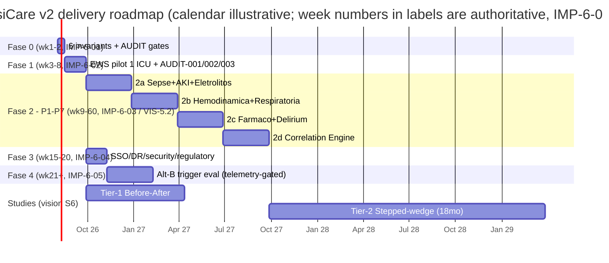

# Delivery Roadmap — IntensiCare v2

**Owner:** plan-editor-in-chief · **Status:** phased delivery roadmap — dossier input for the delivery barrier · **Authority precedence:** ADR-001 ≻ vision ≻ directive ≻ audit (`docs/plan/_work/schemas/CONTRACTS.md` §5).

This roadmap maps vision §5's priority order (P1→P7) onto implementation-plan's Fase 0-4 delivery skeleton (`IMP-6-01..05`): per-phase objectives, `ALERT-*` family scope, ratification/audit entry gates, and vision §7 metric exit gates. It is the **strategic layer** — what ships, in what order, gated by what. `delivery/build-orchestrator-blueprint.md` is the **execution layer** — which work order, which agent, which CI gate proves it; this document cites work-order (`WO-*`) ids only where needed to source a dependency, never repeats their detail.

> **Load-bearing framing.** Two independent phase-numbering schemes exist in the source corpus and must not be conflated. (1) impl-plan §6 **Fase 0-4** (`IMP-6-01..05`), in weeks, is this roadmap's spine. (2) vision §5.2 **Fase 2a-2d** (`VIS-5.2-01..04`), in months, is the P1-P7 clinical-domain rollout *cadence*, nested entirely inside spine-Fase 2 (confirmed independently by `build-orchestrator-blueprint.md` §3: "Domains in P1-P7 order, Weeks 9-14+"). A third label — implementation-plan.md / product-spec.md's MoSCoW "Fase 1/2/3" (MUST/SHOULD/COULD priority tiers, US-01..30) — is not a timeline axis and is cited here only to cross-check priority, never for week arithmetic.

---

## 0. Sources and legend

| Scheme | Unit | Source | Role here |
|---|---|---|---|
| Fase 0-4 | weeks | `IMP-6-01..05` (implementation-plan.json §6) | Spine of every section below |
| Fase 2a/2b/2c/2d | months | `VIS-5.2-01..04` (vision.json §5.2) | Re-anchored inside spine-Fase 2 (§4) |
| MoSCoW Fase 1/2/3 | priority tier | `IMP-2.2-01..13`; product-spec.md §2 | Cited only for SHOULD/COULD cross-checks |

Not resolved here, only recorded (CONTRACTS §5): the sub-wave week boundaries inside Fase 2 (§4) are this roadmap's own re-anchoring of vision's 3-month cadence to `IMP-6-03`'s Week-9 start — no brief states these exact week numbers verbatim (see §11.1).

## 1. Priority order — follow §5, not §3 (`CON-SEED-06`)

Vision §3 documents domains in the order Sepsis(3.1)/AKI(3.2)/Respiratory(3.3)/Hemodynamic(3.4)/Delirium(3.5)/Electrolyte(3.6)/Drug(3.7). §5.1's **implementation priority order differs and is authoritative for sequencing** (`CON-SEED-06`):

| Priority | Domain (PT verbatim) | Impact | Data availability | Complexity | Fact id |
|---|---|---|---|---|---|
| P1 | Sepse / Infecção | Crítico | Alta (vitals+labs FHIR) | Média | `VIS-5.1-01` |
| P2 | AKI (KDIGO) | Crítico | Alta (creatinina+diurese) | Baixa | `VIS-5.1-02` |
| P3 | Emergências Eletrolíticas | Alto | Alta (painel lab FHIR) | Baixa | `VIS-5.1-03` |
| P4 | Instabilidade Hemodinâmica | Crítico | Média (lactato, PA invasiva) | Média | `VIS-5.1-04` |
| P5 | Insuficiência Respiratória | Alto | Média (dados de ventilador) | Média | `VIS-5.1-05` |
| P6 | Interações Medicamentosas (`pharmaco-interaction` domain) | Moderado | Baixa (integração EMR completa) | Alta | `VIS-5.1-06` |
| P7 | Delirium (`neuro-sedation` domain) | Moderado | Baixa (registro clínico estruturado) | Média | `VIS-5.1-07` |

Rollout cadence: 2a = P1+P2+P3, Meses 1-3 (`VIS-5.2-01`); 2b = P4+P5, Meses 4-6 (`VIS-5.2-02`); 2c = P6+P7, Meses 7-9 (`VIS-5.2-03`); 2d = Correlation Engine + ML-preditivo, Meses 10-12 (`VIS-5.2-04`).

## 2. Fase 0 — Foundation (Weeks 1-2, `IMP-6-01`)

**Objective:** professional repository, honest documentation, functional dev environment.

- **Scope.** No clinical `ALERT-*` family ships. All six pre-first-patient invariants are scaffolded: audit trail (`IMP-C-01`), MSH-10 ingestion idempotency (`IMP-C-02`), `algorithm_version` versioning (`IMP-C-03`), pgcrypto PHI encryption (`IMP-C-04`), health check + dead-man's-switch (`IMP-C-05`), ARQ retry/backoff (`IMP-C-06`).
- **Entry criteria.** None upstream — this is the roadmap's origin. The audit's own ratification asks (`ASK-1..5`, `RATIFICATION.md`) already carry recommended defaults, so downstream design is unblocked (proceed-on-default doctrine, never silent).
- **Exit criteria.** All six invariants pass their `REQ-INV-*` tests and named drills; `check_units.py --strict` green over the canonical registry (`CON-SEED-12`, final convention still pending `ASK-5`). **No real patient data may touch the system before this closes** (`IMP-C-01..06`).

## 3. Fase 1 — MVP Core: hardening + corrections pipeline (Weeks 3-8, `IMP-6-02`)

**Objective:** first functional version with MEWS + alerts for 1 pilot ICU.

- **Scope.** `ALERT-EWS-*` family (4 alerts / 25 test vectors: `NEWS2-DETERIORATION-01`, `TREND-RISING-02`, `SOFA-ACUTE-ORGAN-DYSFUNCTION-03`, `DISCHARGE-READINESS-04`) plus the already-"Implementado" MEWS/NEWS2/SOFA/qSOFA (`VIS-2-01..04`), now corrected. US-01..06 (MUST tier) ship: automated HL7 ingestion, real-time MEWS, threshold alerts, component breakdown, acknowledge, bed board.
- **Entry criteria.** Fase 0 exit. `AUDIT-001` (MEWS band correction, Subbe 2001) and `AUDIT-002` (NEWS2 Scale-2 + supplemental-O₂, RCP 2017) designed and ready to ship **behind an `algorithm_version` flag, pending clinical-committee sign-off** — never silently live; `AUDIT-003` (SOFA single risk-classification path) likewise.
- **Exit criteria.** `VIS-7.2-01` ingestion→alert p95 < 30 s met at pilot scale (`IMP-C-13` MVP budget); `VIS-7.2-05` 100% of scores carry non-null `algorithm_version`; L1/L2 test harness operational; coverage ≥ 80% (exact gate number still open, `IMP-C-17`).

## 4. Fase 2 — Domains in P1-P7 order (Weeks 9-14+, `IMP-6-03`; rollout `VIS-5.2`)

Every domain ships as `_work/alerts/<domain>.yaml` fixtures + engine wiring + UI surface. The "+" is honest: 7 domains + the Correlation Engine do not fit 6 weeks — this roadmap re-anchors vision's own 3-month sub-phase cadence (`VIS-5.2-01..04`) to start at Week 9 (§11.1):

| Sub-wave | Weeks (re-anchored) | Domains (`ALERT-*` family / alerts / vectors) | Entry gate | Fact id |
|---|---|---|---|---|
| 2a | 9-21 | `ALERT-SEPSIS-*` (6/31), `ALERT-AKI-*` (3/17), `ALERT-ELY-*` (6/39) | `RAT-SEPSE-02`/`ASK-4` aggregation default shipped behind flag; `RAT-INGRESS-01` vitals-ingress design-of-record; `ASK-5` unit pins enforced (`CON-SEED-12`) | `VIS-5.2-01` |
| 2b | 22-34 | `ALERT-HEMO-*` (6/34), `ALERT-RESP-*` (5/24) | Graceful degradation when PPV/SVV or ABG absent (data availability Média, `VIS-5.1-04/05`) | `VIS-5.2-02` |
| 2c | 35-47 | `ALERT-PHARMACO-*` (8/34), `ALERT-NEUROSED-*` (8/38) | P6 highest integration risk (Baixa data / Alta complexity, `VIS-5.1-06`); P7 needs structured bedside RASS/CAM-ICU capture built first (US-19 AC3), never free-text parsing | `VIS-5.2-03` |
| 2d | 48-60 | `ALERT-CORR-*` (4/24) | Per-correlation, not fleet-wide — see §4.1 | `VIS-5.2-04` |

Cumulative across all nine `_work/alerts/*.yaml` catalogs: 50 alerts / 266 test vectors (incl. the 25 EWS vectors from Fase 1).

### 4.1 Correlation Engine insertion point — per-pair, not one fleet gate

`ALERT-CORR-*` needs **≥ 2 live member domains per correlation**, not all seven (correlation-engine.md §1/§4; independently confirmed by the Fase-2 exit gate "correlation engine only after ≥2 domains live"):

| Correlation | Needs | Earliest technically viable | Vision-scheduled |
|---|---|---|---|
| `ALERT-CORR-SEPSIS-AKI-01` | P1 + P2 | End of 2a (~wk21) | 2d (wk48-60) |
| `ALERT-CORR-RESP-HEMO-02` | P5 + P4 | End of 2b (~wk34) | 2d |
| `ALERT-CORR-QTC-ELEC-03` | P3 + P6 | End of 2c (~wk47 — gated by the later member, P6) | 2d |
| `ALERT-CORR-EXAM-REDUND-04` | none (stewardship signal, AMH `ServiceRequest`/`DiagnosticReport` repeat-order) | Anytime | 2d |

**Recommendation.** Vision schedules the full Correlation Engine release at 2d; nothing architecturally blocks piloting `ALERT-CORR-SEPSIS-AKI-01` in shadow mode as soon as P1+P2 are live (~wk21), ahead of 2b/2c — an accelerated, product-decision option, not a change to the vision-mandated 2d GA. The fold must never suppress a constituent single-domain alert (`HAZ-026`); correlation is one of five alarm-fatigue levers and, alone, contributes a defensible ~1-6% of fleet volume reduction (correlation-engine.md §1) — never the whole `VIS-7.1-04` gain.

**Fase-2 cross-cutting exit criteria** (once the relevant sub-wave's vectors are green): 7 clinical UI screens pass a11y AA + visual regression; storm test ≥ 500 alerts/min (`VIS-7.2-03`); CLIN-001 (48h real HL7) + CLIN-002 (gold-standard protocol) clinical validation signed; PPV instrumentation live fleet-wide (feeds `VIS-7.1-02`).

## 5. Fase 3 — Production (Weeks 15-20, `IMP-6-04`) — runs concurrently with Fase-2's tail

**Objective:** production deployment, security, DR — largely domain-independent, so it runs on its own Week-15 schedule regardless of which Fase-2 sub-wave is in flight.

- **Scope.** IAM Identity Center SSO supersedes MVP JWT (`ADR001-C-07`); Lake Formation ABAC + per-tenant KMS in prod; WAL-shipping DR (RPO 1h / RTO 1h, `IMP-C-15/16`); capacity 30→90→multi-hospital; TLS end-to-end; external pentest; ANVISA SaMD cadastro engagement (`RQ-1`/`VIS-C-02`); LGPD RIPD (`RQ-2`/`VIS-C-06`).
- **Entry criteria.** Fase 1 exit at minimum — does not wait on Fase-2 sub-wave completion.
- **Exit criteria.** `VIS-7.2-02` availability target reached (99.9% vision vs. 99.5% impl-plan production — both cited, conflict recorded, not resolved here, §11.4); DR drill meets RPO/RTO; pentest clean; ANVISA cadastro + RIPD filed. `regulatory-plan.md` §6 targets SBIS-CFM + pentest for Q4 2026 (draft) — illustratively consistent with a Week 15-20 window if Fase 0 kicks off around Q3 2026.

## 6. Fase 4 — Alternative-B evaluation / ML horizon (Weeks 21+, `IMP-6-05`)

- **Work-ordered scope.** Instrument the ADR-001 Alternativa-B trigger: ingest→alert p95 > 30s over a rolling 7-day window with MLLP healthy, OR MLLP unavailable > 0.5% bed-hours (T1); electrolyte-CRIT freshness (T2). Decide/defer with CTO+AMH sign-off. Depends on real production telemetry, so it realistically overlaps 2b/2c/2d rather than starting sharply at week 21.
- **Further horizon, not yet work-ordered.** `IMP-6-05`'s literal text also names sepsis ML-predictive modeling (MIMIC-IV + local data), Bedrock/SageMaker inference, formal clinical validation, and possible ANVISA Classe-III re-registration. Product-spec §4 WON'T-HAVE #1 keeps this out of active scope pending a formal validation study — recorded as a later horizon, not scheduled (§11.2).
- **Exit criteria.** Alternativa-B decision journaled either way, with CTO+AMH joint sign-off if activated. ML-predictive has no exit criteria yet because it has no open entry gate.

## 7. Vision §7 metrics — which phase closes which gate

| Metric | Baseline → goal | Closes at | Fact id |
|---|---|---|---|
| Sensibilidade sepse (<1h) | 45% → ≥80% | Tier-1 study, post-2a (§8) | `VIS-7.1-01` |
| PPV dos alertas | 35% → ≥60% | Fleet-wide, tracked from 2a onward, re-measured every sub-wave | `VIS-7.1-02` |
| Tempo até ação pós-alerta | 42min → ≤15min | Fase 1 onward (US-05/12/22 instrumentation) | `VIS-7.1-03` |
| Taxa de alarm fatigue | 25% → ≤10% | 2b onward (US-23 analytics) + 2d folding (~1-6%, §4.1) | `VIS-7.1-04` |
| Redução mortalidade UTI | Fase-1 baseline → -10% rel. | Tier-2 stepped-wedge only (§8) | `VIS-7.1-05` |
| Latência ingestão→alerta p95 | — → <30s | Every phase, regression-gated | `VIS-7.2-01` |
| Disponibilidade | — → 99.9% | Fase 3 exit | `VIS-7.2-02` |
| Throughput | — → >500/min | Fase-2 storm-test exit | `VIS-7.2-03` |
| Retenção de dados | — → 7 anos | Fase 0 (config) | `VIS-7.2-04` |
| Versionamento de algoritmos | — → 100% auditável | Fase 0 (schema), enforced every phase | `VIS-7.2-05` |

## 8. Clinical studies (vision §6) anchored to this timeline

Tier-0 analytical validation (regulatory-plan.md §3.1) is continuous and per-alert, inside every sub-wave. Tier-1 Before-After (`VIS-6.1`: 3mo control + 2wk washout + 3mo intervention) opens its control period once shadow-mode scoring exists (Fase 1 / early 2a) and its intervention period once 2a is GA. Tier-2 stepped-wedge cluster RCT (`VIS-6.2`: 8 ICUs, 18 months, CEP+CONEP+ReBEC+ClinicalTrials.gov registration, quarterly DSMB — `VIS-C-14/15/16`) opens only once all seven domains + the Correlation Engine are stable (post-2d, ~wk60+), extending well beyond this roadmap's explicit week table.

## 9. Timeline

## 10. Cross-references

- **Execution mechanics** (work orders, agent routing, CI gates-as-code): `docs/plan/delivery/build-orchestrator-blueprint.md` §3-7.
- **Regulatory dossier inputs:** `docs/plan/delivery/regulatory-plan.md`.
- **Clinical study protocols:** `docs/plan/delivery/validation-plan.md`.
- **Test layer:** `docs/plan/delivery/test-strategy.md`.
- **Open ratifications:** `docs/plan/RATIFICATION.md`.

## 11. Recorded conflicts / open items (not resolved here, CONTRACTS §5)

1. Fase-2 sub-wave week boundaries (§4) are this roadmap's re-anchoring of `VIS-5.2`'s month cadence to `IMP-6-03`'s Week-9 start; no source states these week numbers verbatim.
2. `IMP-6-05`'s literal ML-predictive scope diverges from `build-orchestrator-blueprint.md`'s concrete Fase-4 work order (Alternativa-B evaluation only); both are recorded in §6, not reconciled.
3. Coverage-gate number (`IMP-C-17`: ≥70%/≥85% vs. CI's enforced ≥80%) remains open, tracked to barrier C3.
4. Availability SLO conflict (`VIS-7.2-02` 99.9% vs. `IMP-C-11` 99%/99.5%) recorded, not resolved (product-spec §6 item 2).
5. Data-retention conflict (blanket 7y `VIS-7.2-04` vs. raw-vital 90d, `CON-SEED-03`) is owned by data-architect, not this roadmap.
6. `AUDIT-004/005/006` are cited inconsistently between `regulatory-plan.md` §2 (audit-trail/PHI-encryption/health-check) and `build-orchestrator-blueprint.md` §3 (health-check/retry-backoff cite `AUDIT-004`/`AUDIT-005`; audit-trail/PHI-encryption cite `TECH-001`/`TECH-002` instead). This roadmap cites the unambiguous `IMP-C-01..06` invariant ids throughout (§2) and flags the `AUDIT-00N` numbering mismatch here rather than silently picking one.
